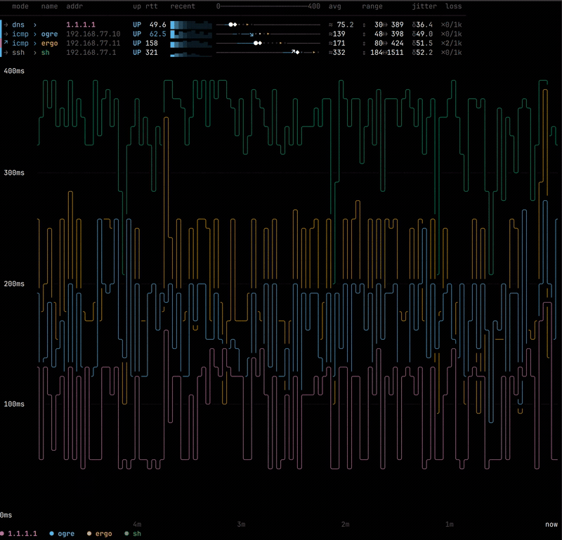

# vlat
 
A creamy and modern ping tool.  A pretty console utility for measuring latency of all kinds.  For latency measurement enthusiasts.




[More Screenshots](screens/README.md)

## Features

- Inline compact modes
  - Keeps your console history visible onscreen.
  - Good for quick target status check
- Fullscreen mode
  - Line graph, bars, ekg modes for overall situational awarness
  * Scatter plots for at a glance relative comparisons
  * Worms and bubbles for impressing your friends
- Protocols
  - icmp (traditional ping)
  - udp
  - tcp
  - tls/quic
  - http/https - configurable paths and methods
  - dns
  - ntp
  - ssh
  - smtp/smpts
  - exec:  Supply your own script to measure anything
- Network Features
  - Configure intervals, timeouts, labels, and probe parameters per target
  - Full IPv6 and IPv4 support
- Data export
  - Real-time CSV or JSON (NDJSON) logging
  - Periodic summary logging (JSON)
  - Debug logging for troubleshooting
- Multiple color schemes
- Interactive tui menu system.
- Remembers previous session stats and command lines 
- ASCII-only fallback mode for low-capability terminals.

## Build

Requires Rust 1.70+ and Cargo.

```sh
cargo build --release
```

The binary will be at `target/release/vlat`.

\* On Linux, `cap_net_raw` capability is needed for ICMP. If ICMP is unavailable and no
explicit `--mode` was set, vlat falls back to UDP.

```sh
# Linux: grant capability to the binary (recommended)
sudo setcap cap_net_raw+ep target/release/vlat

# Or run with sudo
sudo target/release/vlat example.org

# Or use UDP mode (no privileges needed)
target/release/vlat example.org --mode udp
```
## Usage

```
vlat [OPTIONS] [TARGETS]...
```

Omit targets to pick a saved session from a menu instead (see [Sessions](#sessions)).

### Basic examples

```sh
# Ping a single host (ICMP if available, UDP fallback)
vlat example.org

# Ping multiple hosts
vlat 8.8.8.8 1.1.1.1 9.9.9.9

# TCP connection probe
vlat example.org --mode tcp --tcp-port 443

# HTTP/HTTPS RTT
vlat example.org --mode https --http-path /health

# DNS query time
vlat 8.8.8.8 --mode dns --dns-query google.com

# QUIC handshake
vlat example.org --mode quic

# Custom command (measures execution time)
vlat localhost --mode exec --exec-cmd "curl -sf https://api.example.org/health"
```

### Argument Files

You can read targets and options from a file using the `@` prefix. Lines starting with `#` are ignored.

```sh
# targets.txt
# production hosts
web.example.org:tcp:443,label=web
db.internal,interval=500ms,label=db
10.0.0.1,label=gateway

vlat @targets.txt -w 60s
```

### Per-target overrides

Each target can specify its own mode, port, and settings inline:

```sh
# Syntax: host[:mode[:port]][,key=val,...]

# Different intervals and labels per target
vlat "8.8.8.8,interval=200ms,label=google" "1.1.1.1,interval=2s,label=cloudflare"

# Full per-target override
vlat "example.org:tcp:443,interval=500ms,timeout=2s,hpath=/status"
```

Supported keys: `interval`, `timeout`, `resolve` (DNS interval), `label`, `hpath` (HTTP path), `exec` (command).

Targets also accept a URI form as an alternative to `host:mode:port`:

```sh
vlat https://example.org                      # mode+port from scheme
vlat https://example.org:8443/health           # path becomes the hpath override
vlat tcp://10.0.0.1:2222 ssh://build.example.org
```

Any mode with a natural URI scheme works (`http`, `https`, `tcp`, `udp`, `dns`, `tls`, `ntp`, `ssh`, `smtp`, `smtps`, `quic`). `icmp` and `exec` have no URI form. IPv6 hosts must be bracketed, e.g. `https://[::1]:8443/health`.

## Sessions

vlat saves its session (settings + summary stats) to `$XDG_STATE_HOME/vlat/sessions`
(usually `~/.local/state/vlat/sessions`) every 60 seconds and at exit. The 10 most
recent unnamed sessions are kept; named sessions are kept until deleted.

Run `vlat` with no targets to pick a saved session from a menu, or restart by name:

```sh
vlat --session-name home 192.168.1.1 example.net   # run + name the session
vlat --restart home                                # restart it later
vlat --restart home --theme nord                   # restart, override a setting
vlat --no-session example.net                      # don't save this run
```

## Defaults file

vlat automatically loads default flags from a config file at startup (CLI flags
always override it). Search order: `$VLAT_CONFIG` if set, otherwise
`$XDG_CONFIG_HOME/vlat/defaults` (usually `~/.config/vlat/defaults`).

```sh
mkdir -p ~/.config/vlat
echo '--theme nord' >> ~/.config/vlat/defaults
echo '--interval 500ms' >> ~/.config/vlat/defaults
```

The file uses the same one-argument-per-line format as `@argfile` (see [Argument Files](#argument-files)).

## Interactive Keys

While `vlat` is running, you can use the following keys:

| Key | Action                                                 |
|-----|--------------------------------------------------------|
| `h` | Toggle help dialog                                     |
| `e` | Show output legend                                     |
| `v` | Change view (picker): single → list → graph → ekg → radar → bars → cards → scatter → worm → bubble → pong |
| `1`-`9` | Jump to view directly: 1=graph 2=ekg 3=worm 4=radar 5=bars 6=cards 7=bubble 8=scatter 9=pong |
| `x` | Show / hide columns (dialog)                           |
| `k` | Toggle column key header                               |
| `s` | Cycle multi-target sort: mtr → avg → none → name       |
| `t` | Change color theme (picker)                            |
| `i` | Toggle target headers (graph / worm / radar / ekg / bubble / pong views) |
| `w` | Set stats window (dialog; 0 = lifetime)                |
| `r` | Re-resolve DNS for all hostnames now                   |
| `d` | Save current view / theme / sort as defaults           |
| `c` / `j` | Start/stop CSV or JSON logging                         |
| `Space` | Freeze display (probes continue in background)         |
| `q` / `Esc` | Quit and show summary (closes an open dialog first)    |
| `Ctrl-C` | Quit                                                   |

## Probe modes

| Mode | Description | Measures |
|------|-------------|----------|
| `icmp` | ICMP echo request | Network RTT |
| `udp` | UDP datagram | Network RTT via ICMP port unreachable |
| `tcp` | TCP connect | Handshake RTT |
| `http` | HTTP GET | TCP + server response |
| `https` | HTTPS GET | TCP + TLS + server response |
| `tls` | TLS handshake | TCP + TLS setup time |
| `dns` | DNS A-query | DNS query RTT |
| `quic` | QUIC handshake | UDP + QUIC + TLS 1.3 setup |
| `ntp` | NTP request | RTT to time server |
| `ssh` | SSH banner grab | TCP + SSH banner read |
| `smtp` | SMTP greeting | TCP + SMTP banner read |
| `smtps` | SMTPS greeting | TLS + SMTP banner read |
| `exec` | Shell command | Execution duration (exit 0 = Success) |

## Display Options

- `--theme <name>`: Start with a specific theme (`default`, `nord`, `gruvbox`, `dracula`, `solarized`, `okabe`, `highcontrast`, `phosphor`, `retro`, `nocolor`).
- `--ascii`: Use ASCII-only characters (no braille/Unicode).
- `--view <mode>`: Start in a specific view (`list`, `single`, `graph`, `worm`, `radar`, `ekg`, `bars`, `cards`, `bubble`, `scatter`, `pong`). Default: `single` (falls back to `list` with more than one target).
- `--max-range <ms>`: Fix Y-axis maximum (disables auto-scaling).
- `--span <duration>`: Time range shown by the graph (e.g., `10m`).
- `--columns <name,...>`: Columns to display. Stat columns (`mtr`, `std`, `p01`, `p10`, `p50`, `p95`, `p99`, `cv`, `srtt`, `streak`, `recent`, `bar`) are off by default except the `recent` sparkline and range `bar`. Identity columns (`mode`, `name`, `port`, `addr`, `resolve`) follow automatic display rules; naming one forces it on, and `none` hides everything (values after `none` add back, e.g. `--columns none,addr,p99`). `all` shows every column; `default` is the default set and composes (e.g. `--columns default,mtr`). All columns can also be toggled at runtime with the `x` key.

Use `--help` for full option list.
Use `--explain` to explain all statistics and views.

## License

GPLv3. See [LICENSE](LICENSE) for details.
