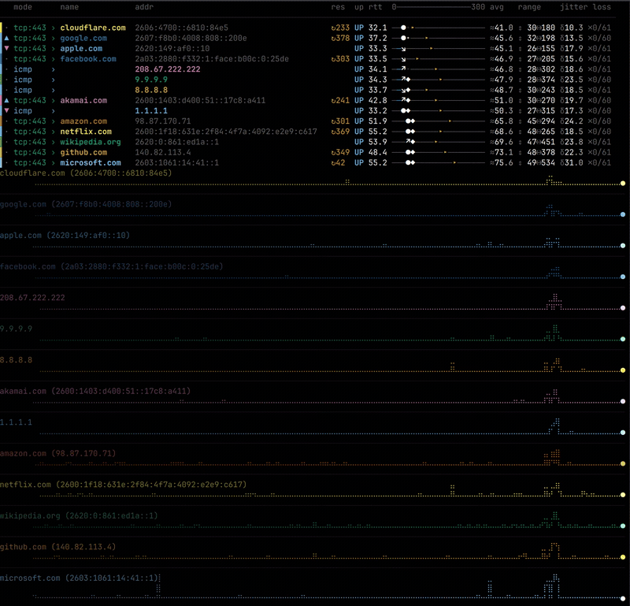
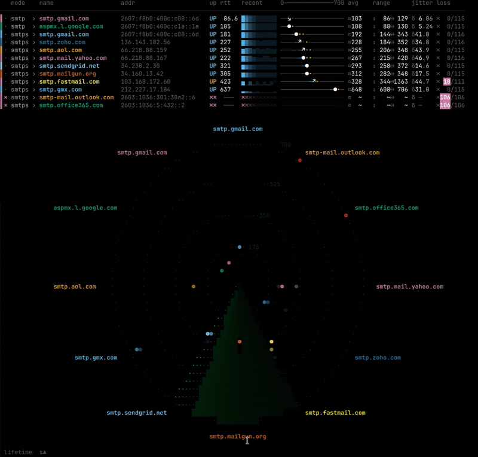

Screens for [vlat](..) latency monitoring tool.

### Single

command line invocation with a single target.

### List

command line invocation with multiple targets target.

### Graph

Fullscreen line graph, one row per target.  Great for overall picture of multiple targets.

### EKG

EKG-style latency monitor shows each targets realtime activity.

### Radar

Radar sweep view, useful for comparative visualization in a novel view.

